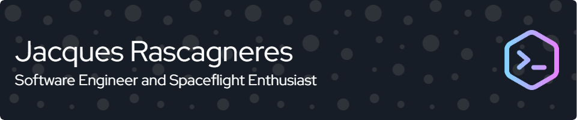

# Hello there👋

I'm Jacques Rascagneres, a Senior Software enginner with a number of years experience developing software. Writing Golang since 2018. Based near Manchester, UK and currently working for Couchbase.

A founder and partner of [TheSpaceDevs](https://thespacedevs.com/) and the founder and owner of [Go4Liftoff](https://go4liftoff.com/), a spaceflight tracking application with a website, mobile app, discord bot and more.

# Github Stats

# Other
- Part of Launch Library 1 since 2016-2020
- Following its closure in 2020 part of a collaborative effort to operate [Launch Library 2](https://ll.thespacedevs.com/) under [The Space Devs](https://thespacedevs.com/)
- Owner and operator of [Go4Liftoff](https://go4liftoff.com/)
